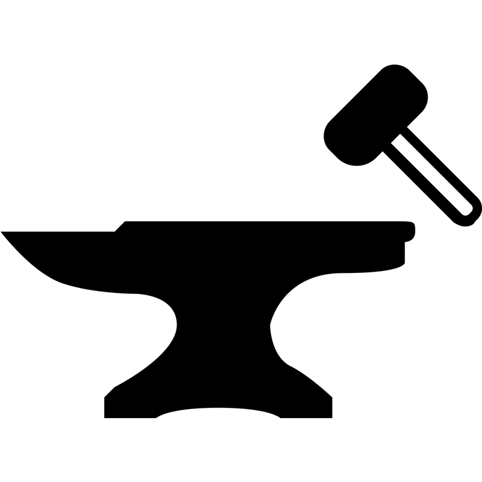

# Guilda
Bem vindo à Guilda, um sistema de RPG colaborativo.

## Ponto de Ingnição

Existe uma variedade imensa de sistemas de RPG (Role Playing Game) de Mesa, cada um com suas próprias peculiaridades, vantagens e desvantágens.
Uma coisa é certa, existe uma coisa em comum entre todos estes sistemas: Nenhum deles é completamente equilibrado, nem nunca vai ser.
Sabendo disso, a proposta da Guilda é trabalhar em um sistema de crescimento contínuo, com melhorias e correções de bugs, assim como um software ou jogo de computador.
O sistema receberá manutenção direta da comunidade e poderá possuir versões, das quais o grupo de jogo pode optar por qual utilizar.
Uma vez com uma versão estável, poderão surgir eventuais patches de atualização ou uma versão completamente nova.

## Premissas Principais
### O jogador deve poder fazer o que ele deseja

## Versionamento

Nós utilizamos [SemVer](http://semver.org/) para versionamento. Para as versões disponíveis, veja as [tags nesse repositório](https://github.com/coppolaop/DungeonManager/tags). 
Para o modelo de branches, utilizaremos o [Modelo de branches de Cacto](https://barro.github.io/2016/02/a-succesful-git-branching-model-considered-harmful/).

## Equipe

### Criador

* **Marcos "Coppola" Gonçalves** - *2020-2022* - [Coppolaop](https://github.com/coppolaop)

### Desenvolvedores

* **Marcos "Coppola" Gonçalves** - *2020-2022* - [Coppolaop](https://github.com/coppolaop)
* **Igor Huayck** - *2020* - [Flaigor](https://github.com/Flaigor)

### Testadores

* **Marcos "Coppola" Gonçalves** - *2020-2022* - [Coppolaop](https://github.com/coppolaop)

## Licença

Esse projeto é licenciado sobre a licença Apache-2.0 - veja a [LICENSE.md](LICENSE) para mais detalhes.